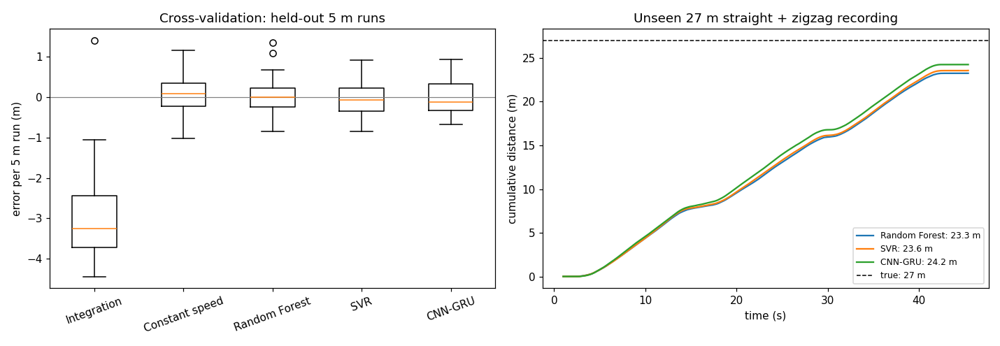
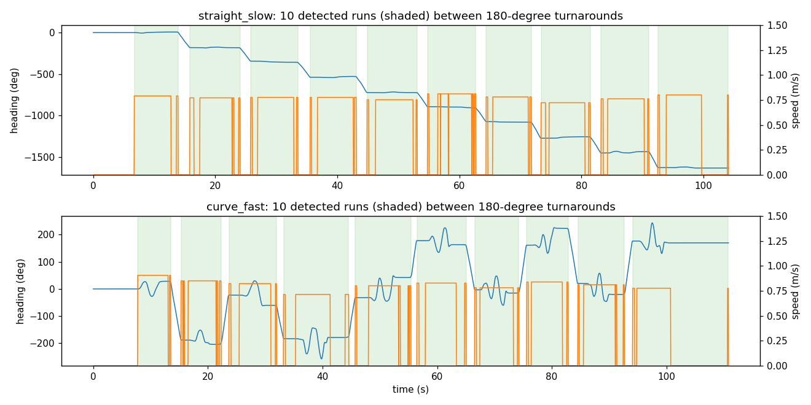

# IMU Distance Estimation for a Mobile Robot

Estimating how far a Direct Drive Diablo robot has driven using only the IMU of an Android
phone mounted on it. Compares double integration, a constant-speed baseline, Random Forest, SVR
and a CNN-GRU network, evaluated on runs the models never saw during training.

Originally a group project (Group 4) for CPSC-5616EL Machine Learning and Deep Learning at
Laurentian University, Fall 2024. This repository is a rebuilt version with a corrected
pipeline and evaluation.

## Results

| Method | Held-out 5 m runs: mean abs. error | Unseen 27 m recording: estimate |
|---|---|---|
| Double integration | 3.03 m (61%) | 6.2 m (−77%) |
| Constant speed × time moving | 0.38 m (7.7%) | **28.0 m (+3.7%)** |
| Random Forest | **0.35 m (6.9%)** | 23.3 m (−13.9%) |
| SVR | 0.36 m (7.1%) | 23.6 m (−12.7%) |
| CNN-GRU | 0.37 m (7.3%) | 24.2 m (−10.2%) |



**What this shows**

- **Double integration fails.** Accelerometer noise and bias accumulate, so integrated
  distance is off by 60% even over 5 m.
- **The learned models are accurate, but no better than a simple baseline.** All three are
  within about 7% per 5 m run. So is multiplying the average training speed by the time the
  accelerometer shows motion. The robot drove at a fairly steady 0.7–0.9 m/s, so most of the
  information is in *when* the robot moves rather than *how fast*.
- **The learned models do not transfer to the later recording.** The 27 m test run was
  recorded three weeks after the training data and vibrates less at a similar speed
  (mean acceleration magnitude while moving: 1.0 m/s² vs 1.2–2.0 m/s²). The models learned to read speed from vibration, so they underestimate it. The
  constant-speed baseline only needs to detect motion and is unaffected.
- The CNN-GRU has the best window-level fit (speed R² 0.95 vs 0.94). Those window labels
  assume constant speed within a run (see below), which makes them easier to fit than real
  distance. The run-level errors above are the meaningful comparison.

Full tables: [results/metrics.md](results/metrics.md). Per-run predictions:
[results/cv_run_predictions.csv](results/cv_run_predictions.csv).

## Data

The course instructor recorded the data and gave permission to publish it here. An Android
phone running Sensor Logger lay flat on the robot. Accelerometer and gyroscope
were recorded at about 26 Hz.

| Recording | Path | Content |
|---|---|---|
| `straight_slow`, `straight_fast` | straight line | 10 runs × 5 m, turning around in place between runs |
| `curve_slow`, `curve_fast` | zigzag | 10 runs × 5 m, turning around in place between runs |
| `mixed_27m` | straight + zigzag | one continuous 27 m path, used only as the final test |

`data/<recording>/` holds the raw `Accelerometer.csv` and `Gyroscope.csv` exports.

### Ground truth

The only true distances are 5 m per run and 27 m for the test path. To train models that
work on short windows:

1. **Find the runs.** Integrating gyroscope z gives the heading. Each in-place turnaround
   is a ~180° step that splits the recording, and all four files yield exactly 10 runs.
2. **Find when the robot moves.** A run's moving time is when the rolling standard
   deviation of acceleration magnitude is above a threshold, outside turns.
3. **Label speed.** The label is 5 m ÷ moving time while moving, and 0 during turns and
   pauses. This assumes constant speed within a run; average speeds were 0.72–0.89 m/s.



## Method

- **Preprocessing:** accelerometer and gyroscope are resampled to a common 25 Hz grid,
  smoothed with a 5-sample moving average, and standardised with statistics from the
  training folds only.
- **Windows:** 2 s windows (50 samples × 6 channels), one every 0.2 s. Each model predicts
  the mean speed in a window, and distance is the sum of the predictions × 0.2 s.
- **Features (RF, SVR):** per-channel mean, standard deviation, min, max, range and mean
  absolute change, plus acceleration and rotation magnitudes.
- **CNN-GRU:** two Conv1D → BatchNorm → ReLU → MaxPool blocks (32 and 64 filters), a GRU
  with 64 units, dropout and a linear output. Trained with Adam and MSE loss, with
  learning-rate reduction and early stopping on validation runs.
- **Augmentation:** jittering and per-channel amplitude scaling, applied to training
  windows only.
- **Evaluation:** 5-fold cross-validation over the 40 runs. Each fold holds out 2 runs from
  every recording, and training windows that overlap a held-out window in time are
  removed. Hyperparameters for RF and SVR are tuned by grid search with run-grouped folds
  inside each training set. The final models are trained on all 40 runs and tested once
  on the 27 m recording.

## Run it

```bash
pip install -r requirements.txt
python run_experiments.py          # about 15 minutes on a laptop CPU
```

This rewrites everything in `results/`. Options: `--epochs`, `--seed`.

```
├── data/                  raw accelerometer and gyroscope CSVs (2.6 MB)
├── imudist/
│   ├── data.py            loading, resampling, run detection, speed labels
│   ├── features.py        windows, statistical features, augmentation
│   └── models.py          integration and constant-speed baselines, RF, SVR, CNN-GRU
├── run_experiments.py     cross-validation, 27 m test, tables and figures
└── results/
```

## Limitations

- One robot, one phone, one floor. The 27 m test shows that a change in vibration alone
  shifts the learned models by 10–14%.
- Speed labels assume constant speed within each run. Wheel odometry from the robot itself
  would give real per-window ground truth.
- Results come from a single random seed. Differences of a few centimetres between the
  learned models are within noise.
- Time warping was not used for augmentation, because a stretched window also needs a
  rescaled speed label.

## Credits

The original course version was built by Shazzad Sakim Sourav and Shadman Ahmed (Group 4).
The IMU recordings were made by the CPSC-5616EL course instructor and are shared with his
permission.

## License

MIT. See [LICENSE](LICENSE).
